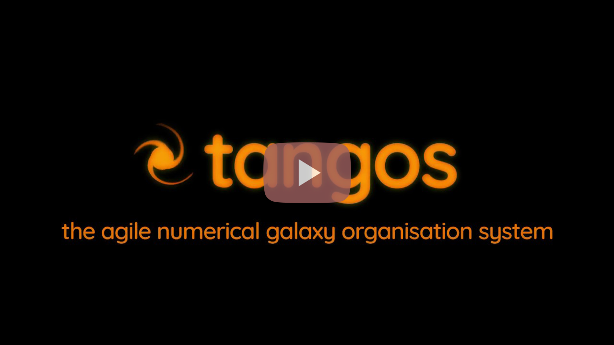

Data exploration with tangos
----------------------------

To see how _tangos_ can be used to explore your simulation data, you first need to 
[set up the package and paths](index.md) and then ensure you have a working database in place.

For the latter, you can either follow the three [first steps](first_steps.md) tutorials which generate a database
from raw simulation data; or you can skip straight to the good stuff by downloading an 
[existing database](ftp://ftp.star.ucl.ac.uk/app/tangos/tangos_data.db) where the three tutorial simulations have already been
imported.

Don't forget either `tangos_data.db` should be in your home folder or you need to set the environment variable
`TANGOS_DB_CONNECTION` appropriately; see the [set up instructions](index.md).

Once all is ready, you can explore the data in one of two ways:

From within python
------------------

Exploring a tangos database from python is explained in an online ipython notebook tutorial: 
[view it here](https://nbviewer.jupyter.org/github/pynbody/tangos/blob/master/docs/Data%20exploration%20with%20python.ipynb).

From within your web browser
----------------------------

To run the server, simply type `tangos serve` at the UNIX command line. 
(For experts: this is  a shortcut to launching pyramid's `pserve`). 
You should see some messages finishing with:
 
```
Serving on http://localhost:6543
```

Navigate your browser to that address to start playing. Click the video below to start a
tour of the data exploration features.

[](https://www.youtube.com/watch?v=xHyzJmNsVMw)

